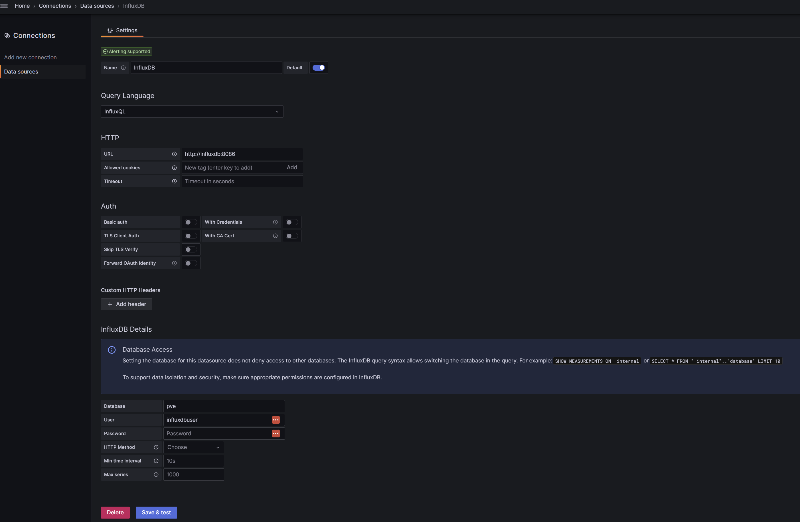

## Proxmox

O Proxmox (PVE - Proxmox Virtualization Enviroment) é uma plataforma de virtualização Open Source, baseada atualmente no Debian, de fácil instalação (https://www.proxmox.com/en/proxmox-ve/get-started) e administração possuindo uma interface limpa e de fácil entendimento.

Popularmente usada em **_home server_** (<https://www.youtube.com/results?search_query=my+home+server+with+proxmox>), mas também podendo ser usada em ambientes de produção, pois é estável, versátil, rápida e fácil de gerenciar, possuindo as opções de máquinas virtuais, a qual utiliza tecnologia KVM (Kernel-based Virtual Machine), sendo um hypervisor e a  opção de criação e gerenciamento de contêineres (OpenVZ e LXC), onde se faz o uso de contêineres.

Além de possuir diversos recursos, o PVE também conta com recursos extras para backup e mail gateway, e suporte na sua versão paga (<https://www.proxmox.com/en/proxmox-virtual-environment/pricing>).

Nesse material, mostrarei como utilizar o Grafana e o Influxdb para uma visualização dos dados de um servidor PVE, obtendo métricas de forma mais clara, rápida, e visualmente fácil de interpretar.

Para essa implantação, usaremos  Garafana e o Influxdb em docker.

## Instalação

Clone o repositório em seu host docker, e navegue até o diretório "xxxxxxxxxx". 

```
git clone https://github.com/luiscruzcwb/prometheus-windows-exporter
```

Execute o comando "docker-compose up -d"

Caso seja necessário, faça os ajustes necessários no **docker-compose.yml** (usuários, senhas e etc.)

## Grafana

Acessando o Grafana:  http://ip-host:3000, a conexão com o InfluxDB já estará configurada conforme dados fornecidos no **environment** do **docker-compose**. 




## Influxdb 

Acessando o InfluxDB: http://ip-host:8086, será solicitado as seguintes configurações iniciais:

	 - Username
	 - Password
	 - Initial Organization Name
	 - Initial Bucket Name

Configure usuário, senha, organização, e bucket, conforme sua preferência. 

Depois de concluir a etapa anterior, você terá acesso a senha de API com privilégios de **superusuário**. 

> [!informação] 
> Para bancos de dados de série temporal (buckets), recomendo se criar tokens de API personalizados com privilégios restritos).

Salve-a em um local seguro, caso futuramente seja necessário o seu uso.


